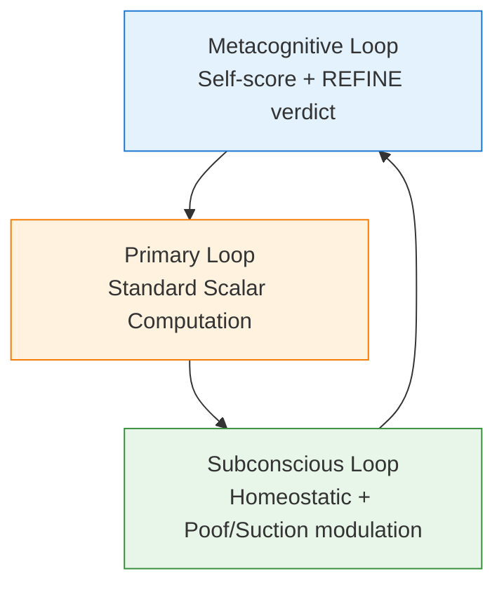

# FSOT Triforce

**Triadic Self-Refining FSOT Engine with Directional Fluid Valve Flow and Light-Gravitational Wave Coupling**

Zero-free-parameter computational framework extending FSOT 2.0/2.1 with intrinsic self-reflection, homeostatic memory, and physically grounded predictions for anisotropic expansion and coupled light-gravity wave propagation.

## Architecture (Tri-FSOT Triforce)



The three loops form a **Triforce** of computation.

## Overview

FSOT Triforce implements a **three-loop computational architecture** (Primary, Metacognitive, Subconscious) that enables the model to think about itself, refine its own outputs, and ground predictions against real data — all while remaining strictly zero-free-parameter.

### Core Capabilities

- **Triadic Looping Computation**
- **Intrinsic Self-Refinement** (FSOT 2.1 style)
- **Refinement Memory** with homeostatic learning
- **Grounding Hook** against real Wave 1 targets
- **Directional Structure Density** modulation
- **Light-Gravitational Wave Coupling** (light surfing gravity wave peaks + tight coupling + redshift entanglement)
- **Precision Self-Refine Loop** targeting coupled-propagation tension

## Getting Started

```bash
git clone https://github.com/dappalumbo91/FSOT-Triforce.git
cd FSOT-Triforce
```

```python
import fsot_tri_compute as tri

state = tri.tri_compute_domain("Cosmology", n_iters=5, verbose=True)
analysis = tri.analyze_tri_run(state)

eng = tri.TriFSOTEngine()
result = eng.precision_self_refine("Cosmology", max_passes=4)

df = tri.directional_expansion_sweep()
print(df)
```

## Key Predictions

### 1. Anisotropic Hubble / Directional Fluid Valve Flow
Expansion rate measurements should show systematic variation correlated with local large-scale structure density.

### 2. Light-Gravitational Wave Coupling
Light surfs gravity wave peaks with tight coupling. Over cosmic distances this produces direction-dependent signals and regimes of higher measurement inconclusiveness.

## License
Apache 2.0 — see [LICENSE](LICENSE)

*FSOT Triforce — Three loops. One unified, self-refining truth-seeking engine.*